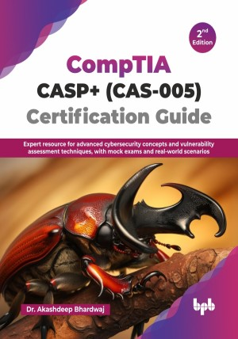

# CompTIA CASP+ (CAS-005) Certification Guide - 2nd Edition

Expert resource for advanced cybersecurity concepts and vulnerability assessment techniques, with mock exams and real-world scenarios.

This is the repository for [CompTIA CASP+ (CAS-005) Certification Guide - 2nd Edition
](https://bpbonline.com/products/comptia-casp-cas-005-certification-guide?variant=44619082105032),published by BPB Publications.

## About the Book
CompTIA Advanced Security Practitioner (CASP+) is a vendor-neutral security certification. It validates advanced-level core technical skills, including active management of security engineering, operations, incidents, handling enterprise-level risk assessments, and IT governance. 

This book navigates the critical domains of the CASP+ exam. It begins by establishing the business and industry context influencing IT security, followed by organizational governance, risk management, and crucial risk mitigation strategies. You will understand enterprise risk measurement, principles of secure architecture, and the practical application of security controls across networks, hosts, storage, and the evolving landscape of IoT and cloud technologies. Furthermore, this book explores application vulnerabilities, the importance of continuous security research, securing communication and collaboration, implementing cryptographic techniques, and mastering IAM. Finally, it covers the vital areas of security operations, incident response, the integration of diverse IT systems, and security considerations in the technology lifecycle; it also includes practice exams to reinforce learning.

This new edition provides a broader coverage of organizational security, including governance, risk, and compliance, as well as a more detailed examination of cloud security and its integration with virtualization. By the end of this book, you will gain an understanding of advanced security concepts and practical techniques, empowering you to confidently tackle the CASP+ certification exam and apply expert-level security skills to protect and defend complex organizational environments.

## What You Will Learn
• Integrate hosts/networks/storage/applications/cloud; manage security lifecycle; assess CASP+ skills via mock exams.

• Analyze real-world scenarios involving cloud, virtualization, networks, servers, applications, and end-user systems. 

• Core technical knowledge and hands-on skills to design, implement, and integrate security solutions across enterprise environments.

• This edition brings enhanced practical learning with the inclusion of a second comprehensive CASP+ skill assessment exam.

• This edition also expands on fundamentals with dedicated coverage of cloud security integration and virtualization technologies.
